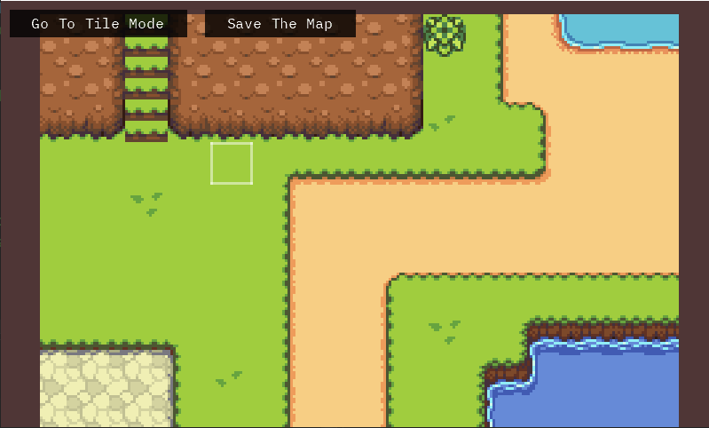

# OkTyles

Deutsch | [English](README.md)

OkTyles ist eine Tile-Map-Engine, bei der jeder Zellen innerhalb der Karte seine eigene Rotation, Kollision und Bildinformationen hat. Dies ermöglicht eine präzise Steuerung der einzelnen Zellen und reduziert den Speicherbedarf auf 32 Bit pro Zelle für eine kompakte Darstellung.

## Funktionen

- Jede Zelle enthält Informationen zur Rotation, Kollision und Darstellung.
- Kompakte Speicherung mit nur 32 Bit pro Zelle.
- Bearbeitung der Karte direkt innerhalb der Engine.
- Freie Bewegung zwischen den Zellen für eine einfache Navigation.
- Individuelle Rotation pro Zelle reduziert die Anzahl der benötigten Tiles.

## Screenshots

*Bearbeite die Karte direkt in der Engine.*

*Bewege dich frei zwischen den Zellen.*

## Installation

1. Klone das Repository: `git clone https://github.com/SameplayerDE/OkTyles.git`
2. Öffne das Projekt in deiner bevorzugten Entwicklungsumgebung.
3. Führe das Projekt aus und beginne mit der Verwendung der Tile-Map-Engine.

## Verwendung

1. Erstelle eine neue Tile-Map oder lade eine vorhandene.
2. Bearbeite die Zellen individuell, um Rotation, Kollision und Bildinformationen festzulegen.
3. Bewege dich frei über die Karte, um Änderungen vorzunehmen oder das Layout anzupassen.
4. Genieße die präzise Kontrolle über jede Zelle und die kompakte Speicherung.

## Beitrag

Fühlst du dich inspiriert? Möchtest du die Tile-Map-Engine verbessern oder erweitern? Contributions sind herzlich willkommen! Öffne einfach einen Pull-Request mit deinen Änderungsvorschlägen.

## Lizenz

Dieses Projekt ist unter der MIT-Lizenz lizenziert. Weitere Informationen findest du in der [Lizenzdatei](https://github.com/SameplayerDE/OkTyles/blob/master/LICENSE).
