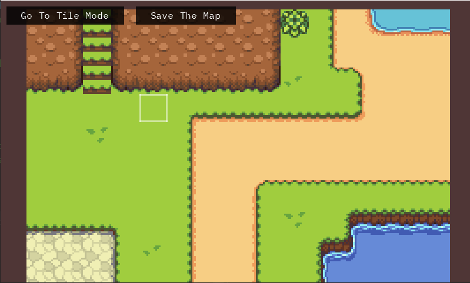
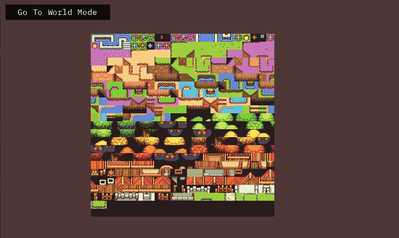

# OkTyles

OkTyles is a tile map editor where each cell within the map has its own rotation, collision, and image information. This allows for precise control over each cell and reduces the memory footprint to 32 bits per cell for a compact representation.

## Features

- Each cell contains rotation, collision, and display information.
- Compact storage with only 32 bits per cell.
- Move freely between tiles for easy navigation.
- Individual rotation per cell reduces the number of required tiles.
- Layer management for organizing and controlling the depth of elements in the map.

## Todo

- Implement Lua scripting support.
- Add support for custom map saving structure.
- Introduce animated tiles functionality.
- Implement tile rules for more dynamic map interactions.

## Screenshots

*Edit the map directly within the editor.*

*Move freely between cells.*

## Installation

1. Clone the repository: `git clone https://github.com/SameplayerDE/OkTyles.git`
2. Open the project in your preferred development environment.
3. Run the project and start using the tile map editor.

## Shortcuts

- **Zoom**: `Mouse Scroll`
- **Pan**: `Mouse Button Middle`
- **Undo**: `Ctrl + Z`
- **Toggle Mirror State**: `Ctrl + R` (Hold `Shift` to toggle show mirror state)
- **Show All Layers**: `Ctrl + Right Shift`
- **Switch Active Layer Up**: `Ctrl + Up`
- **Switch Active Layer Down**: `Ctrl + Down`

## Contribution

Feeling inspired? Want to improve or expand the tile map editor? Contributions are welcome! Simply open a pull request with your proposed changes.

## License

This project is licensed under the MIT License. For more information, see the [LICENSE](https://github.com/SameplayerDE/OkTyles/blob/master/LICENSE) file.
